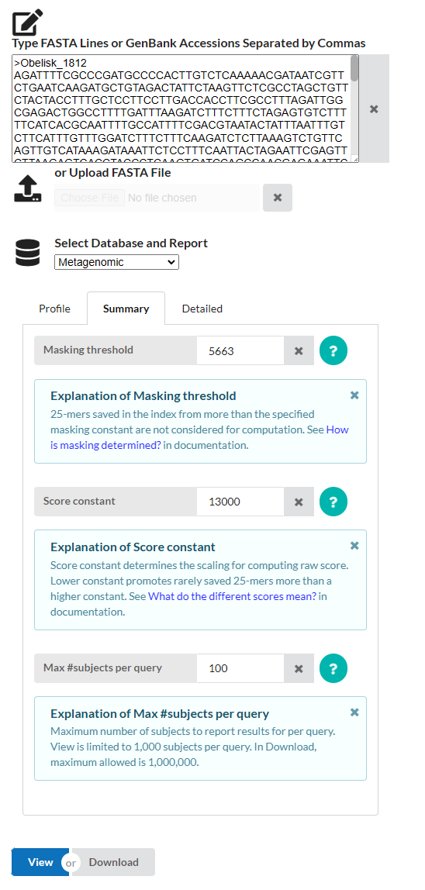
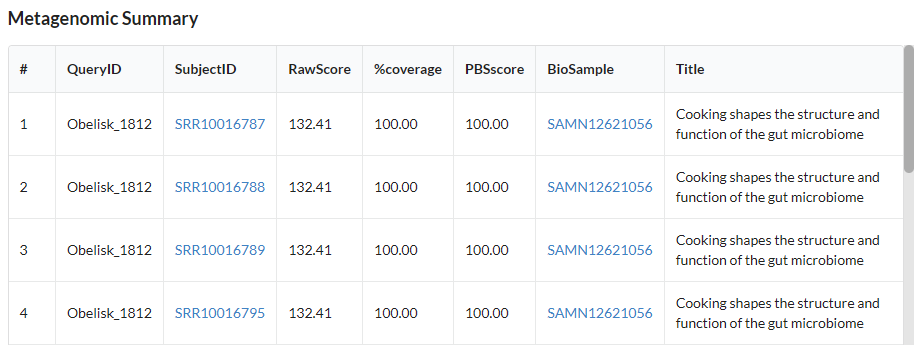

# {PebbleScout}

written by: [Meijin Wu](https://github.com/yourname%20*optional%20link*)

[5 minute] This tutorial gives an overview for using the PebbleScout
tool developed by NCBI. PebbleScout is a tool that searches for subjects
in large nucleotide databases, including Metagenomic (SRA), WGS,
RefSeq,etc. PebbleScout is a useful tool to search for presence of your
specific obelisk in these databases, and provide an overview of the
BioSamples from which the sequence is found.

**Tutorial Objective**: After this tutorial, you will be able to search
for your obelisk in all runs documented in the SRA database.

## Input / Prerequisites

-   Access to [PebbleScout](https://pebblescout.ncbi.nlm.nih.gov/)
-   Example data: simply copy your sequence of interest
-   Nucleotide sequence, FASTA file, or GenBank Accessions CSV files.
-   No other specific system or other requirements are needed.

## Output

{A text description of the expected OUTPUT generated by this tool, it's
file format, and possibly a brief statement of it's utility.} The tool
provides a .tsv file containing the SubjectID of all SRA runs where the
query sequence is found, along with a RawScore, %coverage, PBSscore,
Biosample, and title of the study the BioSample is found in. A web
version of the table will be available to view in the browser.

### 1. Navigate to [PebbleScout](https://pebblescout.ncbi.nlm.nih.gov/)

### 2. Input your query

Copy the sequence for your obelisk, and paste it into the input window.

### 2. Select Database

In "Select Database and Report", select "Metagenomic" database - this is
most relevant for our purposes, but feel free to explore other databases
as well.

### 3. Adjust parameters (optional)

For your query search, you can adjust: - Masking threshold (k-mers
sampled from more subjects than this amount will be ignored) - Score
constant (Effects the calculation of RawScores, learn more
[here](https://pebblescout.ncbi.nlm.nih.gov/?view=doc#s-3)) - Max number
of subjects per query (the maximum number of outputs reported)

### 4. Run & view or download data

Click "View" at the bottom of the page to view the results in browser,
click "Download" to download the results as a .tsv file. 

### Conclusion

That's it! You've used the PebbleScout to search for your obelisk in the
database!

Here, we used PebbleScout to look for matches to our obelisk sequence in
the SRA database.This is a powerful and efficient tool to get an
overview of BioSamples from studies that may contain your sequence in
order to explore the digital ecology of your obelisk.

### See Also:

-   [Indexing and searching petabase-scale nucleotide
    resources](https://www.nature.com/articles/s41592-024-02280-z)
-   [PebbleScout
    Documentation](https://pebblescout.ncbi.nlm.nih.gov/?view=doc#s-3)
