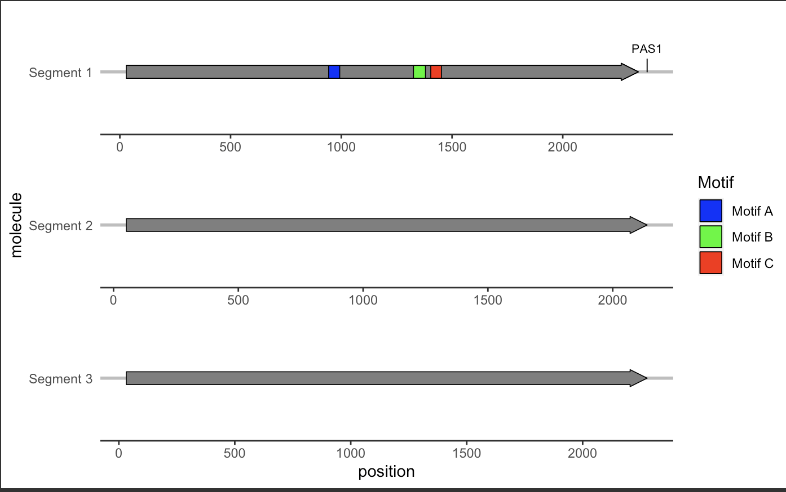
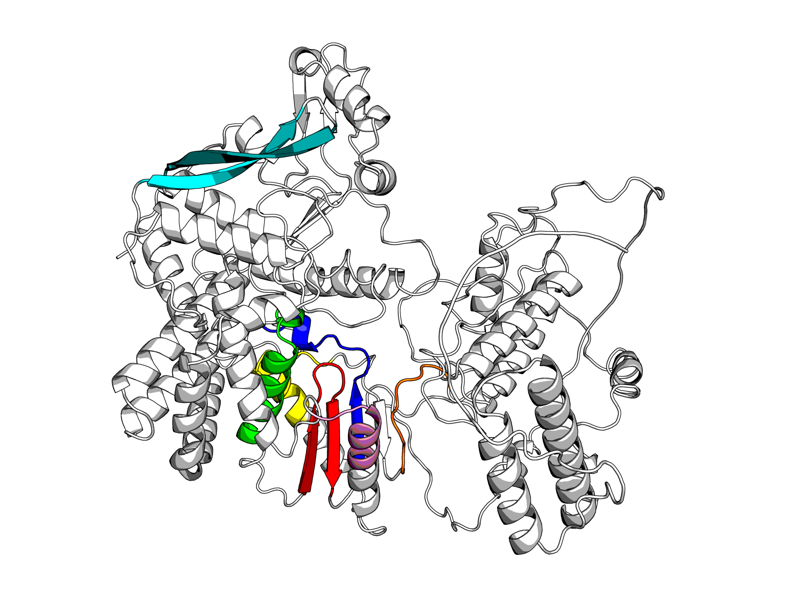
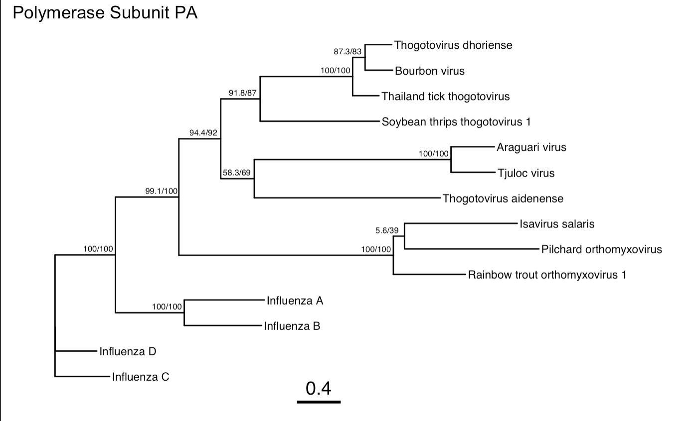
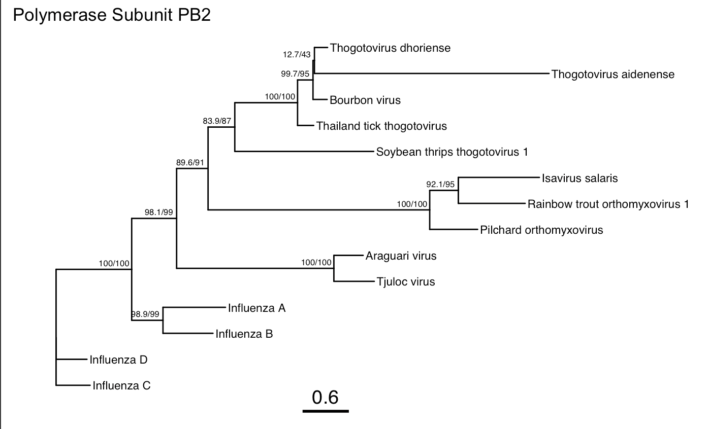

# Potato Pests' Peculiar Passenger: A Thogotovirus Tale in G. rostochiensis
written by: Aiden Hiller

### Thogotovirus aidenensis
Thogotovirus aidenensis. I'm tentatively placing my virus in the genus
thogotovirus as homology of the currently-identified segments are strongly within
that genus. However, with the divergence of the RdRp, it's possible additional segments
may be discovered that would evade the definition of a thogotovirus. The species name
is named after myself, because why not. 

## Abstract

Parasitic plant nematodes are a major threat to global food security, causing
billions of dollars in crop damage annually. The potato cyst nematodes Globodera rostochiensis  
and Globodera pallida are particularly devastating to potato crops in Europe, Asia, and
Africa. Current attempts to control these pests rely on chemical nematicides, which are
outlawed in many countries due to their environmental impact, thus necessitating the
need for alterantive control strategies. Here, we report the discovery of a novel virus
discovered in transcriptomic samples of G. rostochiensis and G. pallida, Thogotovirus aidenense.
Thogotoviruses are currently understood to be tick-borne vertebrate pathogens, with a broad
host range including humans and several species of livestock. Along with the influenza
viruses, they are members of the family Orthomyxoviridae, which possess negative sense
RNA genomes encoded on multiple segments. Our analysis reveals the potential for Thogotovirus
aidenense as a hypovirulence factor for G. rostochiensis, suggesting its potential use
as a biocontrol agent. We anticipate this discovery will lead to further research into
the use of viruses as biocontrol agents for plant parasitic nematodes.

## Results

### SRA Distribution

sOTU u507489, designated Thogotovirus aidenense, was identified in seven distinct sequencing runs encompassed
within four unique bioprojects, as revealed by Serratus. The run I chose to assemble was
SRR16693885, which had the highest coverage of the virus. This run was part of the bioproject PRJNA764088, which
is linked to a 2023 study at Wageningen University in the Netherlands (Steenbrugge et al, 2023).
The authors were studying transcription factor binding motifs upstream of 'effector' genes, which
are responsible for conferring virulence to the plant parasitic nematodes Globoerda rostochiensis
and Globodera pallida. For this study, they constructed new reference genomes for both species, using
strains for both that were uncharacteristically hypovirulent. Thogotovirus aidenense was not identified in the
G. pallida strain, but was found in G. rostochiensis. The authors did not comment on the virus, and
were likely unaware of its presence. 

The specific line of G. rostochiensis used in the study , 'Gr-line 19,' traces back to an earlier
study at Wageningen (Janssen et al, 1990). Here, the authors produced 63 F3 lines as a result of
inbreeding a wild avirulent population. Gr-line 19 did not produce any cysts on potato cultivar Saturna
and was thus considered avirulent. One of the other bioprojects (PRJNA471544) used the same strain of 
G. rostochiensis (Sabeh et al, 2019). Notably, they also sequenced several other species of Globodera, 
but the virus was not detected in any of these samples. 

As for the other two, it's unclear what strains were used. One of these bioprojects (PRJEB2896) is unpublished,
but notably contains a run from a different species, G. pallida, where the virus was identified. The coverage is
comparatively low, however, and it remains to be seen if the virus is capable of infecting multiple species.
The other does not identify the strain, only the pathotype (PRJEB12075), and that the nematodes were obtained from 
the James Hutton Institute in Scotland (Eves-van den Akker et al, 2016). Interestingly, the authors note their 
transcript selection strategy used oligo-dT beads, which suggests the virus has polyadenylated transcripts.

### Thogotovirus Aidenensis Genome




**Figure 1**: Genome Map and RNA secondary structure. (Top) Genome map of the three putative identified subunits of Thogotovirus aidenensis, PB1, PB2, and PA. RdRp motifs A, B, and C are labelled on the PB1-encoding segment. (Bottom) RNA secondary structure of the PB1 segment.

### Structural Analysis



**Figure 2**: Alphafold predicted structure of PB1. RdRp motifs A, B, and C are labelled on the structure in blue, green, and red, respectively. 

### Phylogenetic Analysis






**Figure 3**: Phylogenetic analysis of Thogotovirus aidenensis. (Top) Phylogenetic analysis of the PA subunit of the polymerase. (Middle) Phylogenetic analysis of the PB1 subunit of the polymerase. (Bottom) Phylogenetic analysis of the PB2 subunit of the polymerase. The tree was constructed using IQ-TREE v2 with 1000 bootstraps and sh-aLRT. The scale bar represents the number of substitutions per site. Multiple sequence alignment was constructed using MUSCLE. 

## Discussion

I've identified a novel virus that is likely a highly diverged member of the 
Thogotovirus genus within the family Orthomyxoviridae. Thus far, I've only been
able to recover three segments of the virus, which encode the PB1, PA, and PB2
polymerase subunits. It is likely the virus has additional segments, including
a nucleoprotein, matrix protein, and glycoprotein, as these are conserved across
all members of the family. Thus, currently the genome is incomplete as the additional
segments are too far diverged to be identified via homology search.
It's possible the virus is a hypovirulence factor for the potato-parasitic nematode
G. rostochiensis, as it was identified in multiple sequencing runs of a strain that
is known to be avirulent with respect to cyst formation. Moreover, it might be capable
of infecting the sister species G. pallida.

## References

1. Wilkins, D. & Kurtz, Z. gggenes: Draw Gene Arrow Maps in ‘ggplot2’. (2023).
2. Wickham, H. et al. ggplot2: Create Elegant Data Visualisations Using the Grammar of Graphics. (2023).
3. Yu, G. et al. ggtree: an R package for visualization of tree and annotation data. (2023) doi:10.18129/B9.bioc.ggtree.
4. Minh, B. Q. et al. IQ-TREE 2: New Models and Efficient Methods for Phylogenetic Inference in the Genomic Era. Molecular Biology and Evolution 37, 1530–1534 (2020).
5. MUSCLE: multiple sequence alignment with high accuracy and high throughput | Nucleic Acids Research | Oxford Academic. https://academic.oup.com/nar/article/32/5/1792/2380623.
6. Weber, F., Haller, O. & Kochs, G. Nucleoprotein viral RNA and mRNA of Thogoto virus: a novel ‘cap-stealing’ mechanism in tick-borne orthomyxoviruses? Journal of Virology 70, 8361–8367 (1996).
7. Orthomyxoviridae | ICTV. https://ictv.global/report_9th/RNAneg/Orthomyxoviridae.
8. Leahy, M. B., Dessens, J. T., Weber, F., Kochs, G. & Nuttall, P. A. The fourth genus in the Orthomyxoviridae: sequence analyses of two Thogoto virus polymerase proteins and comparison with influenza viruses. Virus Research 50, 215–224 (1997).
9. Eves-van den Akker, S. et al. The genome of the yellow potato cyst nematode, Globodera rostochiensis, reveals insights into the basis of parasitism and virulence. Genome Biol 17, 124 (2016).
10. Jennings, S., Martínez-Sobrido, L., García-Sastre, A., Weber, F. & Kochs, G. Thogoto virus ML protein suppresses IRF3 function. Virology 331, 63–72 (2005).
11. Yu, G. et al. treeio: Base Classes and Functions for Phylogenetic Tree Input and Output. (2023) doi:10.18129/B9.bioc.treeio.
12. Lorenz, R. et al. ViennaRNA Package 2.0. Algorithms for Molecular Biology 6, 26 (2011).
13. King, A. M., Lefkowitz, E., Adams, M. J. & Carstens, E. B. Virus Taxonomy: Ninth Report of the International Committee on Taxonomy of Viruses. (Elsevier, 2011).
14. Sabeh, M., Lord, E., Grenier, É., St-Arnaud, M. & Mimee, B. What determines host specificity in hyperspecialized plant parasitic nematodes? BMC Genomics 20, 457 (2019).
15. JANSSEN, Richard, Jaap BAKKER, and Fred J. GOMMERS. "Selection of virulent and avirulent lines of Globodera rostochiensis for the H, resistance gene in Solanurn tuberosurn ssp. andigena CPC 1673." Revue Nérnatol 13.3 (1990): 265-268.

# Viral Short Story

In the style of Dr Seuss:
```
In a lab in Toronto, with ideas so bright,
A student uncovered a fascinating sight.
A nematode, Globodera rostochiensis, was its name,
Hiding a secret, soon to claim fame.
This tiny creature, so small and so sly,
Harbored a virus, one couldn't deny.
Related to thogotovirus, small and unseen,
A discovery quite significant, not at all routine.
Far away in Wageningen, under a microscope's gaze,
Researchers were studying nematode's ways.
In their data, so vast and so deep,
A peculiar pattern began to creep.
In a lab so bright, with machines that beep,
Scientists studied this worm in a leap.
On an Illumina machine, in the year 2021,
They sequenced its genome, oh what fun!
This tiny virus, a curious thing,
Might make the worm's life a bit troubling.
It changes the worm in a way not so grand,
Making its life harder on the land.
The researchers pondered, with a thoughtful frown,
"How does this virus bring the nematode down?"
They scribbled and sketched in their big science den,
In Wageningen, where potatoes grew in the glen.
And thus the adventure, with new turns and twists,
Unraveled a story, too intriguing to resist.
About viruses, nematodes, and the science of life,
In a world full of wonder, discovery, and strife.
```
