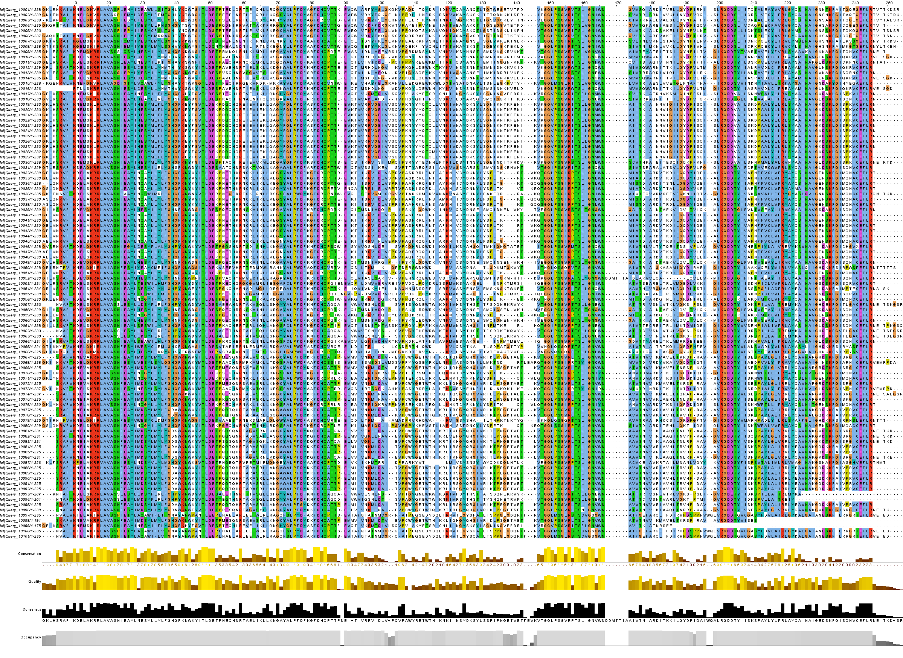
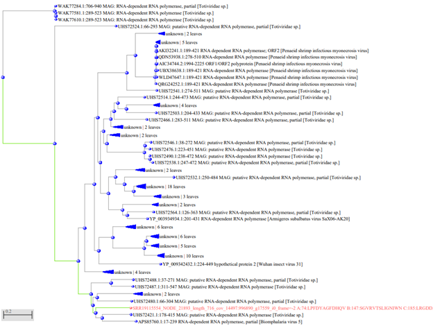

# {Unveiling a winged sensation: 'Totally Viral' – the bat's blockbuster, Totivirus arthropodamyoti!}
written by: [Isabel Li]

### {Totivirus arthropodamyoti}
*{Totivirus is for the species that the virus belongs to and the term 'arthropodamyoti' relates to the phylum arthropods and myoti refers to the Myotis species. This relates to the story of my virus because the virus belongs to the Totivirus family and the virus is transferred from the arthropod species to species from Myotis myotis species.}*


## Abstract
This study focuses on a novel virus with the sOTU 'u508736', which we term Totivirus arthropodamyoti(Ta) which was found in 15 SRR runs. BLASTP analysis of an index run SRR1911554 revealed 40 hits, with the top hit being a Totivirus sp. (accession: 'UCD53724.1') exhibiting 56.98% identity, 8e-65 e-value, and 100% query cover. Delving into the taxonomic distribution of the hits shows that most hits derived from the Totiviridae family which belongs to the Riboviria clade. Multiple SRR runs derived from studies studying the virome of bats and arthropods that are found on the surface of bats. Another study was from investigating the genome of soil. From this study there is evidence suggesting the virus is transfered from the organisms in the soil to arthropods and then transferred to bats such as Myotis myotis. Thus, it could be that arthrops are a vector and bats are reservoir hosts for the virus.

## Results

### Ecology - sOTU ‘u508736’

The virus assigned has the sOTU ‘u508736’, which was associated with 15 SRRs runs in the 'virusobservationsfile'. The assigned index run SRR19115554 was analyzed using BLASTP and produced 40 hits shown in Figure 1. The top hit is a Totivirus sp. with the accession number 'UCD53724.1', a 56.98% identity, 8e-65 e-value, and 100% query cover. The taxonomy of the hits are shown in Figure 2 where it detected several species from the Totiviridae family in the Riboviria clade. The hit with the highest percent identity,UCD53721,was from a paper investigating the virome of bat-infesting arthropods which strongly supports that bats are reservoirs for certain viruses which may have been derived from the blood-sucking arthropods (bat flies, ticks, mites and fleas) that feed on the blood of bats [Xu. 2022]. These bats were from the southwestern Yunnan Province. The second highest percent identity hit UPT53691.1, Zeugodacus tau toti-like virus1, came from a paper investigate the fruit flies, Bactrocera and Zeugodacus, from several provinces in China [Zhang 2022]. Then, I also did tblastn which searched the translated nucleotide sequence database for the protein sequence from SRR1911554. This resulted in the same species as top hits which were from the Totiviridae class.

From the other observations of the assigned sOTU, I found other SRRs containing the sOTU which were from projects 'PRJNA453114', 'PRJNA835632', 'PRJNA834940', 'PRJNA693645' involving organisms: Myotis myotis, Calliphora vicina, Phumosia chukanella, Stegodyphus africanus. The Stegodyphus africanus were from South Africa, Myotis myotis were from Sweden, Calliphora vicina were purchased from suppliers in Germany. The publication associated with SRR19115554 is a study of the virome of bat colonies in Sweden [Wiederkehr 2022]. 

Overall, most of the publications associated with my findings from BLAST and the SRR accessions are studies of the viruses in potential hosts/reservoirs. The common associated host class appears to be bat species and the vector seems to be arthropods such as flies. 

Upon filtering the 'virusRdRPCandidates' file for the barcode 'u508736', it resulted in 2087 matches with an A, B and C motif detected. The highest coverage (144497.99) was 'NODE_21893'. Then, I looked into the transcript using BLAST using the 'Somewhat similar sequences' parameter as there were no significant hits with 'megablast'. There were four hits in this search for similar sequences in which three were from the Totiviridae sp. (MZ218615.1,KY024325.1, MZ218620.1) and one was from Biomphalaria virus 5 (KY024325.1). The associated publications from these Totiviridae hits used environmental samples (animal faecal samles on terrestrial sites) across China. The Biomphalaria virus 5 was found in freshwater snails from the genus Biomphalaria which is a host of the parasite Schistosoma mansoni.

### Totivirus arthropodamyoti Genome 


>Figure 1. Genome map of Totivirus Arthropodamyoti. The first open reading frame (3048 nt) encodes a coat protein and the second open reading frame (1821 nt) encodes a RNA-dependent RNA polymerase (RdRp). The RdRp contains conserved motifs A, B, and C shown in red, green and blue respectively.

### Alphafold structure of Totivirus arthropodamyoti RdRp


>Figure 2. Alphafold structure of the Totivirus Arthropodamyoti RdRp. This is a predicted tertiary structure of the RdRp visualized in PyMol. The RdRp contains three conserved motifs A(red), B(green) and C(blue).

###  Multiple sequence alignment of the RdRp sequence

>Figure 3. Multiple sequence alignment (MSA) of Totivirus arthropodamyoti RdRp and top hits in BLASTP analysis. The Totivirus arthropodamyoti RdRP was analysed on BLASTP and the sequence of top hits were aligned with the Totivirus arthropodamyoti RdRp using Clustal W. The alignments were visualized on Jalview.


>Figure 4. Phylogenetic tree of Totivirus arthropodamyoti and BLASTP hits. A phylogenetic tree was generated (Dendroscope) using the BLASTp hits from the Totivirus arthropodamyoti RdRp.

## Discussion
Here we have characterized the virus, 'Totivirus athropodamyotis' as identified by its barcode 'u508736' which was associated with 15 SRR runs. Through multiple forms of analyses, this virus was identified as a Totivirus. The index run SRR1911554 revealed features that are found in Totiviruses including the two ORFs producing the coat protein (CP) and the RdRp. However, it was surprising to see that there was no slippage site in the Totivirus athropodamyotis. This suggests that there is no overlap between the two ORFs and thus no fusion CP-RdRp that is made unlike in other Totivirus species.

BLASTP analysis of the index run, SRR19115554, provides evidence that this virus is found in many bats and in arthropods. One study associated with one of the top BLAST hits investigated the arthropod virome collected from the surface of a few bat species which highly suggests that the virus is transmitted from arthropods to bats when the arthropods feed on the blood of bats. Another study contained one of the BLAST hits in which the samples came from faeces in the environment/soil across China. This is perhaps suggestive that the faeces may contain the virus that is somehow transferred to arthropods that feed on bats. It is known that Totiviruses are also commonly found in fungal species such as yeast. Thus, it could be that there are fungal species which host the virus and transfers it to bats. Overall, this suggests a complex interplay between bats, arthropods, and other species in the transfer of this virus.

## References

{Altschul S. 2018. Gapped BLAST and PSI-BLAST: a new generation of protein database search programs. Nucleic Acids Research. 25(17):3389–3402. doi:https://doi.org/10.1093/nar/25.17.3389.

Altschul SF, Gish W, Miller W, Myers EW, Lipman DJ. 1990. Basic local alignment search tool. Journal of Molecular Biology. 215(3):403–410. doi:https://doi.org/10.1016/s0022-2836(05)80360-2.

Chen Y-M, Sadiq S, Tian J-H, Chen X, Lin X-D, Shen J-J, Chen H, Hao Z-Y, Wille M, Zhou Z-C, et al. 2022. RNA viromes from terrestrial sites across China expand environmental viral diversity. Nature Microbiology. 7(8):1312–1323. doi:https://doi.org/10.1038/s41564-022-01180-2. [accessed 2023 Dec 9]. https://www.nature.com/articles/s41564-022-01180-2#Sec8.

Edgar RC, Taylor J, Lin V, Altman T, Barbera P, Meleshko D, Lohr D, Novakovsky G, Buchfink B, Al-Shayeb B, et al. 2022. Petabase-scale sequence alignment catalyses viral discovery. Nature. 602(7895):142–147. doi:https://doi.org/10.1038/s41586-021-04332-2.

Galinier R, Tetreau G, Portet A, Pinaud S, Duval D, Gourbal B. 2017. First characterization of viruses from freshwater snails of the genus Biomphalaria , the intermediate host of the parasite Schistosoma mansoni. Acta Tropica. 167:196–203. doi:https://doi.org/10.1016/j.actatropica.2016.12.021.

Myriam Anja Wiederkehr, Qi W, Schoenbaechler K, Cornel Fraefel, Kubacki J. 2022. Virus Diversity, Abundance, and Evolution in Three Different Bat Colonies in Switzerland. Viruses. 14(9):1911–1911. doi:https://doi.org/10.3390/v14091911.

NCBI. 2019. Home - ORFfinder - NCBI. Nihgov. https://www.ncbi.nlm.nih.gov/orffinder/.

Papadopoulos JS, Agarwala R. 2007. COBALT: constraint-based alignment tool for multiple protein sequences. Bioinformatics. 23(9):1073–1079. doi:https://doi.org/10.1093/bioinformatics/btm076. [accessed 2020 Jul 10]. https://academic.oup.com/bioinformatics/article/23/9/1073/272774.

Totiviridae | ICTV. ictvglobal. https://ictv.global/report_9th/dsRNA/Totiviridae.

Xu Z, Feng Y, Chen X, Mǎng Shī, Fu S, Yang W, Liu WJ, Gao GF, Liang G. 2022. Virome of Bat-Infesting Arthropods: Highly Divergent Viruses in Different Vectors. Journal of Virology. 96(4). doi:https://doi.org/10.1128/jvi.01464-21. [accessed 2023 Dec 9]. https://www.ncbi.nlm.nih.gov/pmc/articles/PMC8865543/.

Zheng L, Lu X, Liang X, Jiang S, Zhao J, Zhan G, Liu P, Wu J, Kang Z. 2017. Molecular Characterization of Novel Totivirus-Like Double-Stranded RNAs from Puccinia striiformis f. sp. tritici, the Causal Agent of Wheat Stripe Rust. Frontiers in Microbiology. 8. doi:https://doi.org/10.3389/fmicb.2017.01960.}

# Viral Short Story

```
After million years of habitat destruction, the only source of food left was farmed bats.  Little did the people of this dystopian town know, that the bat food industry would be faced with an apocalypse. One day, the laboratory next to the bat farm cave had an unfortunate leak of the Totiviruses they were studying. In the next few weeks, the farmers panicked as they saw that their carefully bred bats were dying so quickly and quickly people were starving and fighting over what little food was left. 
In an interview of the scientists who were responsible for this disaster, they explained about how the devastating Totiviruses affected the farms nationwide. The scientist said that “These are a dangerous type of virus called the Totiviruses that are affecting all the Myotis species. It is causing the disease called the Cardiomyopathy syndrome (CMS) and the virus replicates itself over an over using its RdRp to transcribe the virion’s dsRNA. The virion itself has a surface structure which looks like chemokines which naturally occurs as an immune response so it creates never-ending inflammation in the body. Ultimately, leading to death. This is a serious issue that needs a solution fast. Us scientists at the facility, are quickly working to find a solution, one solution we have been trying to use is a vaccine that has proteins targeting the RdRps of these Totiviruses.”.

Only after a few days, the scientists were quickly able to come up with a vaccine using the strategy of targeting the RdRps and they successfully were able to eliminate the disease from the last few bats left in the industry. A week went by, and the bat industry was once again thriving and the scientists went from being the villians to the heroes of the world.
```